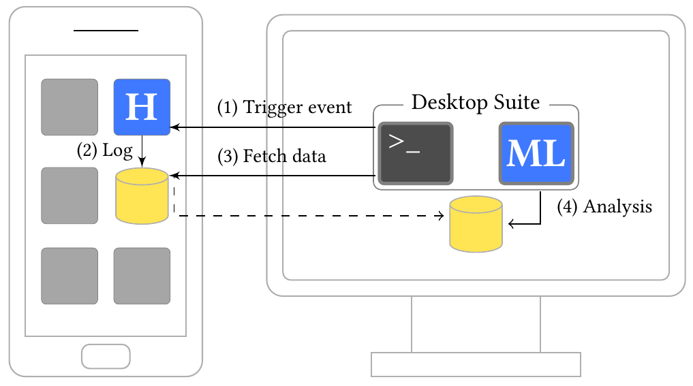

# ProcHarvester

> This is the Proof-of-Concept implementation of ProcHarvester, a tool published at ASIACCS 2018.
> See the "[ProcHarvester](https://rspreitzer.github.io/publications/proc/asiaccs-2018-paper-2.pdf)" paper by Spreitzer, Kirchengast, Gruss, and Mangard for more details.

This repository contains a tool to analyze the procfs on Android-based devices for possible information leaks. ProcHarvester relies on the concept of template attacks. Thus, it works without prior knowledge about possible information leaks. 

## Design of ProcHarvester
The following figure illustrates the design of ProcHarvester, which consists of an Android app (H) and the Desktop Suite. The Desktop Suite consists of a tool to control the Android app as well as the Android device via the [Android Debug Bridge (ADB)](https://developer.android.com/studio/command-line/adb), and an analysis framework (ML) to analyze the information leaks. 

The basic work flow is as follows:

1. **Trigger Event:** The Desktop Suite triggers events, such as app starts, website launches, or keyboard gestures, on the device. 
2. **Log:** The Android app (H) profiles/reads procfs resources, while events are being triggered. 
3. **Fetch Data:** After the profiling phase, the log files are fetched to the Desktop Suite. 
4. **Analysis:** The log files are analyzed to identify information leaks that allow inferring the triggered events. 

## Evaluation
We used ProcHarvester to analyze information leaks that allow inferring the following events from procfs resources:
* App starts
* Website launches
* Keyboard gestures

## One note before starting
**Warning:** This code is provided as-is. You are responsible for protecting yourself, your property and data, and others from any risks caused by this code. This code may not detect vulnerabilities in your application/OS or device. This code is only for testing purposes. Use it only on test systems which contain no sensitive data.

